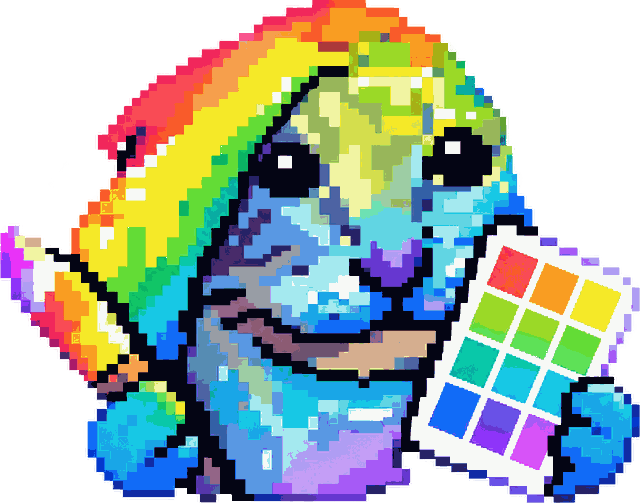

<div align="center">
  
</div>

# lumina studio 手填色卡

<div align="center">

[](LICENSE)
[](CONTENT-LICENSE.md)
[](https://github.com/xwnxzz/lumina-handfill-cards/releases/latest)
[](#测试)
[](#隐私)
[](#隐私)

</div>

手工测量色块 RGB、离线生成 Lumina Studio 板面图的单文件工具。
把色差仪 / 色度计的读数（或从照片取样的数值）填进网格，工具会**实时预览并导出可直接使用的板面图**，
不依赖网络、不上传任何数据。适用于没有条件用官方「拍照提取」流程、或想自己控制每个色块数值的场景。

## 这是什么

Lumina Studio 的耗材档案通常靠「拍一张梯度卡 → 软件自动提取」来生成。但拍照提取会受光线、
曝光、白平衡影响（官方也会因此给出 `ΔE`、`基底信号过弱`、`零厚度采样偏暗` 之类的警告）。

这个工具走另一条路：**你自己测，工具只负责画**。你提供 36 个（或校准板的 1024–1444 个）色块的
RGB 数值，它即时渲染出与实物排布一致的板面图，导出后即可用于存档、核对或后续处理。

## 输入约定与数据语义（重要）

**① 输入必须是 sRGB 编码的 RGB。**
默认模式要求 0–255 的 **sRGB 编码值**（不是线性值、不是 Lab/XYZ）。

- 色差仪 / 色度计直接给 sRGB 读数 → 用默认模式直接填
- 仪器给的是 **Lab / XYZ / 光谱** → 请先自行转换到 sRGB 再填；本工具不做色彩空间换算
- 仪器直接给 **线性光强 0–1** → 勾选「输入已是线性值」

**② `空` 与 `0` 含义不同。**

| 值 | 含义 |
|---|---|
| 留空（`null`） | **未测量** —— 导出时留空，不参与计算，图里画斜纹 |
| `0` | **实测就是 0**（纯黑）—— 是有效数据 |

工具不会把「没填」当成「黑色」。校准板的格子要**三个通道都填**才算完成，
只填了一部分是「半填」状态，界面与计数都会标出来。

**③ 导出的 PNG 是「数值载体」，不是色彩管理过的印刷参考。**
PNG 里写的是 8-bit sRGB 数值，与你在网格里输入的一致。
它**不保证**在不同显示器 / 不同软件里看起来一致——那取决于对方的色彩管理。

**④ 体检（sanity）看的是相对亮度趋势。**
- 白底板：层数越多应越暗（单调不增）
- 黑底板：层数越多应越亮（单调不减，由正向模型 `E ≥ C0` 决定）
- 只有超出容差的反转才会提示；提示是**弱信号**，用于发现「色块 ↔ 厚度」对应填错

## 导出可直接导入 Lumina 的耗材档案 ZIP

填完 36 格后，在「耗材档案」一栏填上**品牌**与**耗材名称**，点
**「导出耗材档案 ZIP」** —— 工具会在**浏览器里**完成全部计算并打包：

```
lumina_material_export.json
lumina_material_bundle.json
materials/<品牌>/<耗材名称>/material.json            (kind=lumina_stage_a_material, schema 1.1)
materials/<品牌>/<耗材名称>/stage_A_parameters.json  (param_type=stage_A)
```

**导入**：Lumina Studio → **耗材管理** → 耗材库 → **导入耗材 ZIP**

包里就是 Stage A 拟合结果（每 RGB 通道一组 `E` / `k`、两个基底的 `C0`），
字段与官方耗材档案一致，不需要装 Python，也不联网。

> 拟合用的是与 `tools/lumina_profile_writer.py` **同一套算法**
> （`C(t) = E + (C0 − E)·exp(−k·t)`，给定 k 时 E 线性可解，再对 k 粗搜 + 两级细搜），
> 并已用官方导出包里的样本验证过：浏览器端算出的 `E`/`k` 与官方结果一致
> （见 `tests/material_zip_test.cjs`）。
> 顶部两个输出按钮「导出测量 CSV」「导出板面图」保持原样，三条导出互不影响。

## 本仓库只做独立版

本仓库只发布**独立版**：单个离线 HTML，在浏览器里直接打开即可用。
（曾经尝试过的「Lumina Studio 创意工坊插件版」已从本仓库移除，
计划另开仓库单独做；相关代码仍保留在本仓库的 git 历史里
（`v1.1.0` ～ `v1.2.0`），需要时可以 `git show v1.2.0:workshop/shim.js` 取回。
## 功能

### 模式一：耗材管理 · 梯度卡填色（3 × 6 = 18 格单阶板）

- 两块板：白底板 + 黑底板，共 36 格
- 18 个厚度档：0, 1, 2, …, 16, 25 层（层高 0.08 mm，即 0 – 2.0 mm）
- **裸基底格（0 层）固定在右上角**（实物板是水平镜像的，所以第 1 行从左到右是 5 → 0 层）
- 实时预览 + 体检提醒（越厚越亮 / 白底比黑底暗 / 零厚度采样偏暗）
- 导出：`导出两张图片（ZIP）`（含白底板、黑底板两张 PNG）、或单独导出某一张
- CSV：可导入 / 导出 `substrate,thickness_mm,r,g,b`

### 模式二：LUT 管理 · 校准板填色

适配官方的全部颜色模式：

| 颜色模式 | 数据网格 | 物理网格 | 格数 | 页数 |
|---|---|---|---|---|
| BW (Black & White) | 6 × 6 | 8 × 8 | 32 | 1 |
| 4-Color (CMYW) | 32 × 32 | 34 × 34 | 1024 | 1 |
| 4-Color (RYBW) | 32 × 32 | 34 × 34 | 1024 | 1 |
| 5-Color Extended (1444) | 32 / 38 | 34 / 40 | 1024 + 1444 | 2 |
| 6-Color (CMYWGK 1296) | 36 × 36 | 38 × 38 | 1296 | 1 |
| 6-Color (RYBWGK 1296) | 36 × 36 | 38 × 38 | 1296 | 1 |
| 8-Color Max | 37 × 37 | 39 × 39 | 1369 | 2 |

- 点选式填色 + 键盘方向键移动
- 导出：`导出当前页图片`（PNG）、`导出全部页图片（ZIP）`
- CSV：可导入 / 导出，可选是否包含未填格（便于在 Excel 里看完整网格布局）

### 通用

- **自动保存**：填的数据存在浏览器本机（`localStorage`），刷新 / 重开不丢，也可一键清空
- **导出走系统「另存为」对话框**，默认落在**「下载」**文件夹
- 浅色 / 深色 / 跟随系统主题
- 完全离线：单个 HTML 文件，无外部依赖、无网络请求

## 快速开始

### 方式一：一键启动（推荐）

从 Release 下载 **`lumina-handfill-cards-v1.4.0.zip`**，解压后双击
**`一键启动_手填色卡.cmd`** 即可。解压出来的根目录里就有：

```
手填色卡.html              主工具（Release 包里的名字）
一键启动_手填色卡.cmd       双击这个
一键启动_手填色卡.ps1       脚本的可读源码
```

启动器会：

1. 找到同目录下的主工具 HTML —— 依次尝试 `手填色卡.html` 和
   `lumina_singlestage_gui.html` **两个名字**，两个都认
2. 解除 Windows 给下载文件打的「来自 Internet」锁定标记（`Unblock-File`），
   省掉下面「导出文件被拦」那节的手工操作
3. 用默认浏览器打开（默认关联失败时退回 Edge / Chrome）

不需要安装任何东西，也不会弹一堆窗口。

> **启动器和主工具 HTML 必须在同一个文件夹里。**
> 启动器按「自己所在目录」去找主工具，所以**两个文件改成任何名字都照常工作**。

> **关于文件名**：仓库里主工具叫 `lumina_singlestage_gui.html`（测试与文档共 9 处引用
> 这个原名，不能改）；**Release 打的包里**统一改名成 `手填色卡.html`。
> 源码里那份 `lumina_singlestage_gui.html` 依然在包内可用，改名只影响打包结果。

> `一键启动_手填色卡.ps1` 是同一个脚本的可读源码，方便你查看或改动。
> 想直接运行它请用「右键 → 使用 PowerShell 运行」，双击默认只会用记事本打开。

### 方式二：手动打开

1. 双击 `lumina_singlestage_gui.html`，用 Edge / Chrome 打开
2. 选择上方两个模式之一
3. 按网格上标出的层数 / 序号填入 RGB
4. 预览确认无误后导出

> 色差仪 / 色度计的 RGB 读数就用默认的 **sRGB 模式**（0–255）。
> 只有仪器直接输出线性光强（0–1）时才勾选「输入已是线性值」。

### Windows 提示：导出文件被拦

如果双击打开（`file://` 页面），Windows 可能把下载下来的文件标成**「受限站点」**，
之后打开时提示「Windows 发现此文件可能有害」。这不是文件本身有问题，是系统的区域策略。

遇到时二选一：

- 导出后对文件「右键 → 属性 → 勾选**解除锁定**」
- 或者用「另存为」保存（工具默认就走这条路，一般不会触发）

## 数据保存在哪

| 键 | 内容 | 体积参考 |
|---|---|---|
| `lumina-gradv1` | 梯度卡 36 格 | 约 0.1 KB（稀疏存储） |
| `lumina-calv1` | 校准板各模式各页 | 单块满载约 21 KB |
| `lumina-theme` | 主题偏好 | — |

存储是**稀疏**的：只存填了值的格子。清空方式：梯度卡的「全部清空」、校准板的「清空全部数据」。

## 工具脚本

`tools/lumina_profile_writer.py` —— 离线拟合脚本，把测量数据拟合成耗材档案 ZIP。

```bash
# 自检（确认拟合实现正确）
python tools/lumina_profile_writer.py --selftest

# 生成空白测量模板
python tools/lumina_profile_writer.py --make-template

# 由测量 CSV 生成档案 ZIP
python tools/lumina_profile_writer.py --brand "品牌" --name "耗材名" \
    --measurements data/测量模板.csv --template 官方档案.zip --out 输出.zip
```

依赖：Python 3 + numpy。无 scipy 依赖。

## 目录结构

```
assets/
  logo.png                    项目 logo（README 顶部）
LICENSE                       代码许可（MIT）
CONTENT-LICENSE.md            内容许可（CC BY-NC-SA 4.0）
NOTICE.md                     第三方来源、逐篇署名与 AI 辅助说明
lumina_singlestage_gui.html   主工具（单文件，离线；Release 打的包里改名为 手填色卡.html）
一键启动_手填色卡.cmd          一键启动：找主工具（两个名字都认）→ 解除锁定 → 打开浏览器
一键启动_手填色卡.ps1          同一个脚本的可读源码（带注释）
tools/
  lumina_profile_writer.py    离线拟合脚本
docs/
  手动写耗材档案_指南.md
  梯度卡图像转换流程.md
  两块校准板_参数填写表.md
  8色校准板_官方规格与单元总表.md
  SingleStage采集生成器_说明.md
  官方规格核对.md               与官方 2.0 资源逐项核对的记录（证实 / 修正 / 未验证）
data/
  测量模板.csv                 空白测量表（36 行）
tests/
  p0p1p2_test.cjs             36 项（梯度卡持久化 / CSV / 钳制 / ZIP）
  p0_test.cjs                 28 项（校准板持久化 + CSV 兼容）
  review_fixes_test.cjs       34 项（第一轮外部代码评审的发现）
  review2_fixes_test.cjs      39 项（第二轮评审：线性 CSV 往返、规格契约、映射链）
  official_spec_test.cjs      98 项（与官方 2.0 资源逐项核对：校准板几何 / 槽位 / 四角标 / 调色板 + 梯度卡规格）
  calzip_test.cjs             ZIP 命名与条目
  zip2_test.cjs               ZIP 结构
  shot.ps1                    无头浏览器截图（验证用）
```

## 测试

需要 Node.js。在仓库根目录执行：

```bash
node tests/run_all.cjs           # 一次跑完全部（305 项 + Python 自检，单进程无弹窗），推荐
node tests/p0p1p2_test.cjs       # 通过 36，失败 0
node tests/p0_test.cjs           # 通过 28，失败 0
node tests/review_fixes_test.cjs # 通过 34，失败 0
node tests/review2_fixes_test.cjs # 通过 39，失败 0
node tests/official_spec_test.cjs # 通过 98，失败 0（纯常量校验，无需本机安装）
node tests/calzip_test.cjs
node tests/zip2_test.cjs
```

> 顶部那个「tests 62 passing」徽章是**本地实测结果**，目前还没有 CI，所以它**不会自动更新**。
> 加上 GitHub Actions 之后会换成实时徽章。

这些测试把主工具里的**真实代码抽出来**在隔离沙箱里跑（不是复制一份来测），
覆盖：时间戳、持久化往返、输入钳制、CSV 导入导出往返（含无表头文件与旧格式兼容）、
ZIP 结构与命名、存储不可用时的降级、未知模式的安全性，以及「未测量 vs 实测 0」的语义、
体检的方向感知、脏本地存储的拦截。

`tests/shot.ps1` 是无头 Edge 截图的辅助脚本，用于人工核对界面渲染，不属于自动化测试。

## 技术说明

### 正向模型

耗材档案的核心是每条通道的衰减曲线，形式为：

```
C(t) = E + (C0 − E) · exp(−k · t)        t 单位 mm，逐 RGB 通道
```

- `C0 = srgb_to_linear(零厚度实测值 / 255)`，即**裸基底那一格的实测值**
- `E ≥ 0`（钳制），`k` 与 `E` 在同一耗材的各基底间共享，各基底各有自己的 `C0`
- 拟合优度按全部样本（含 t = 0）计算

裸基底那格是整条曲线的**锚点**：它把「耗材自身衰减」和「基底反射」分开。
所以那一格必须来自实测（或用色差仪读），不能用理想值顶替——照片有偏色时尤其如此。

### 板面方向

实物板的裸基底格在**右上角**，而软件的规范网格是左上角为 0 层，
即实物板相对规范网格是**水平镜像**的。工具内部按此换算，因此每格标注的层数与实物一致。

### ZIP

内置一个极简 ZIP 写入器（STORE 不压缩 + 标准 CRC32 + UTF-8 文件名标记），
避免依赖任何第三方库，保证单文件离线可用。

## 隐私

- 全部计算在浏览器本地完成，**不联网、不上传、无遥测**
- 无外部字体 / CDN / 统计脚本
- 测量数据只存在你自己的浏览器里，删除即消失

> 唯一的外部请求来自 **README 顶部的徽章图片**（由 GitHub 页面渲染时加载 `img.shields.io`）。
> 那只是给仓库页面看的，**工具本体一个外部请求都没有** —— 下载 HTML 后断网也能完整使用。

## 免责声明

本项目是**非官方**的第三方工具，与 Lumina Studio 官方无关联。

涉及的文件格式（耗材档案、校准板布局、颜色模式等）通过分析用户自己导出的文件与公开文档
整理而成，仅用于互操作目的。

本仓库**不包含任何官方二进制文件或官方导出的数据表**；所有代码与文档均为本项目自行编写。
使用时需要你自备官方套件与自己的测量数据。

## 已知限制

- 校准板的 5-Color Extended 第 2 页、6-Color 模式需要官方 `smart` 系列算法才能生成完整配方，
  本工具只负责填色与出图，不做配方求解
- 板面几何（色块尺寸 5 mm、间距 0.8 mm 等）目前按官方规格固定，未做可调
- 梯度卡模式与校准板模式各自独立保存，互不影响

## 许可

与本项目参考的 [Lumina Studio Wiki](https://github.com/lumina-layer-studio/Lumina-Studio-Wiki)
一致，采用**代码与内容分开许可**：

| 范围 | 许可 | 文件 |
|---|---|---|
| 源代码：`lumina_singlestage_gui.html`、`tools/`、`tests/` | **MIT** | [`LICENSE`](LICENSE) |
| 文档与文字内容：`README.md`、`docs/`、`data/测量模板.csv` | **CC BY-NC-SA 4.0** | [`CONTENT-LICENSE.md`](CONTENT-LICENSE.md) |
| 第三方来源、逐篇署名、AI 辅助说明 | — | [`NOTICE.md`](NOTICE.md) |

请注意 **CC BY-NC-SA 4.0 禁止商业性使用**，且改编内容需继续以相同许可发布。

`docs/` 中改编自 Lumina Studio Wiki 的文档已按该许可的要求逐篇署名
（来源链接 + 许可 + 修改说明），见 [`NOTICE.md`](NOTICE.md)。

> **AI 辅助说明**：本仓库的文档由 AI 协助撰写（依据用户自己导出的档案包、官方公开文档与
> 公开仓库整理），并已与用户实际打印的官方套件逐项核对。沿用 Lumina Studio Wiki 的
> 披露惯例，特此说明。软件持续更新，内容可能存在疏漏，欢迎提 Issue 或 PR。
